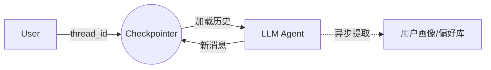
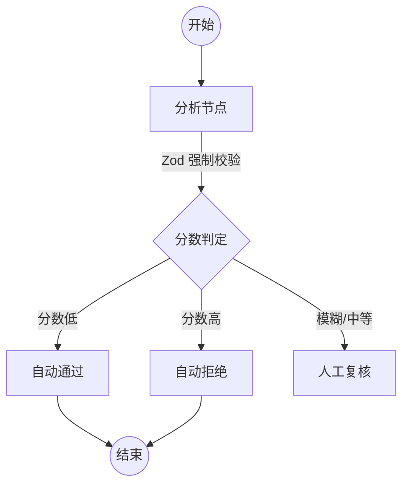
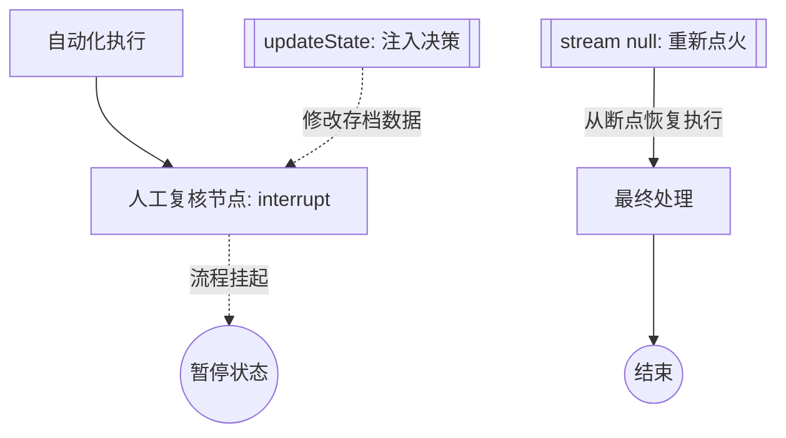

# 🤖 LangGraph 实战学习笔记

## 1. 记忆管理与偏好持久化 (`assistant.ts`)
**核心知识点：** 解决 AI “转头就忘”的问题，并实现海量对话下的关键信息提取。
* **物理记忆 (`Checkpointer`)**: 自动保存 `messages`。只要 `thread_id` 一致，服务器重启后 AI 也能接上话。
* **thread_id**: 对话的唯一凭证。
* **隔离性**: 不同 ID 之间的状态互不干扰，实现“千人千面”。
* 2. app.invoke 时的内部动作
    当你调用 app.invoke(input, config) 时，LangGraph 内部其实偷偷做了三件事： 

    读档（Load）：根据 config 里的 thread_id，把之前的 messages 和状态提取出来。 

    合并（Merge）：把你这次传进去的新 input（Alice 说喜欢冰美式）接在旧历史后面。 

    存档（Save）：等这次对话跑完，自动把最新的完整状态（包含 AI 的回答）写回 MemorySaver。
* **生命周期**: `MemorySaver` 随进程结束而清空；若需永久存储，请查阅 `SqliteSaver` 实现。
* **精华提取 (`extractNode`)**: 异步分析长对话，将核心事实（如“用户偏好 Python”）存入独立的 State 字段，实现跨会话的长期偏好记忆。

---

## 2. 状态机工程：流程控制 (`analysis.ts`)
**核心知识点：** 消除 LLM 的不确定性，将业务逻辑硬编码为“铁轨”，确保程序按预设路径运行。
* **结构化校验 (`Zod`)**: 强制要求 LLM 按 JSON 格式输出，通过强类型约束确保下游节点数据解析 100% 稳定。
* **条件分流 (`ConditionalEdges`)**: LLM 只负责打分（如“毒性分数”），由代码逻辑决定是“直接通过”、“自动拒绝”还是“进入人工复核”。

---

## 3. 人机协作：暂停与干预 (`interactive.ts`)
**核心知识点：** 实现高风险任务的“人工确认”机制，是 Agent 进入生产环境的关键。
* **断点挂起 (`interrupt`)**: 流程运行至此强制**断电并存档**。程序不再运行，不消耗资源，直至外部信号介入。
   将信息给前端，用户审批之后，继续执行
* **状态注入 (`updateState`)**: 外部审核员直接修改“存档数据”。在停机状态下把人的决策（如 `approve`）塞入状态库。
* **无损复活 (`stream(null)`)**: 再次点火时传 `null`，程序会读取修改后的存档，直接从断点处向下执行，不再重复运行前面的逻辑。

